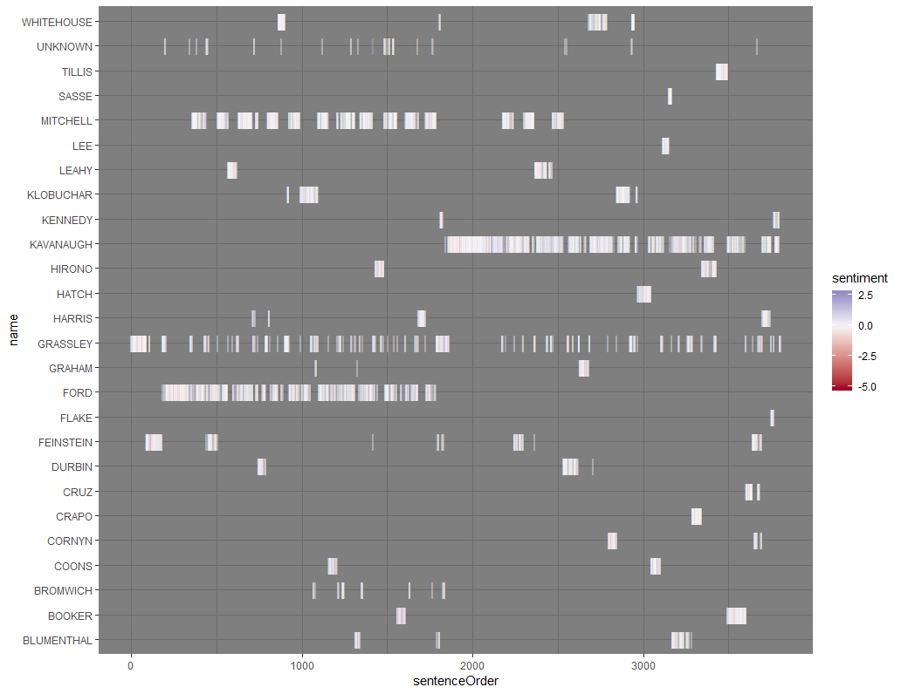

## Kavanaugh Hearing Transcript Analysis

Since the Washington Post offered up the transcripts of the proceedings, I thought it would be worthwhile to parse the data into a tidy csv file -- I am sure that I am not the only person who might have some interest in it.

I will do a lot more with it, but the following plots are just descriptive starts.

### Formality By Person 

### Conversation Flow

### Conversation Flow With Sentiment

